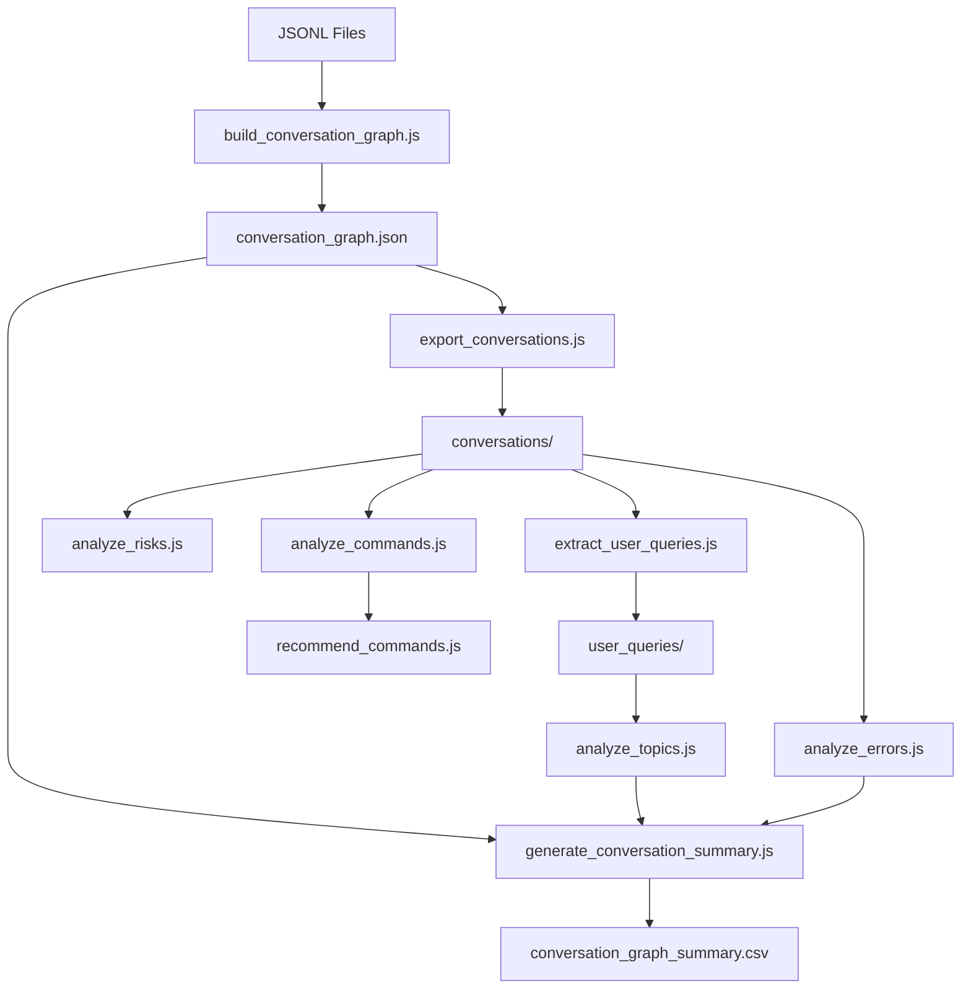

# CC Conversation Analyzer - Improvement Plan

> **Document Version**: 1.0
> **Created**: 2025-11-25
> **Status**: Planning Phase

---

## Executive Summary

This document outlines the comprehensive improvement plan for the CC Conversation Analyzer skill. The skill provides valuable analysis of Claude Code conversation logs, but has opportunities for enhancement in reliability, usability, and feature completeness.

---

## Table of Contents

1. [Current State Assessment](#current-state-assessment)
2. [High Priority Improvements](#high-priority-improvements)
3. [Medium Priority Improvements](#medium-priority-improvements)
4. [Nice-to-Have Enhancements](#nice-to-have-enhancements)
5. [Documentation Improvements](#documentation-improvements)
6. [Implementation Roadmap](#implementation-roadmap)
7. [Technical Specifications](#technical-specifications)

---

## Current State Assessment

### Architecture Overview

```
┌─────────────────────────────────────────────────────────────────┐
│                    CC Conversation Analyzer                      │
├─────────────────────────────────────────────────────────────────┤
│                                                                  │
│  JSONL Files ──► build_conversation_graph.js                    │
│                         │                                        │
│                         ▼                                        │
│              conversation_graph.json                             │
│                         │                                        │
│           ┌─────────────┼─────────────┐                         │
│           ▼             ▼             ▼                         │
│   export_conversations  │    analyze_risks.js                   │
│           │             │             │                         │
│           ▼             │             ▼                         │
│   extract_user_queries  │    risk_analysis.csv                  │
│           │             │                                        │
│           ▼             ▼                                        │
│   analyze_topics.js   analyze_errors.js                         │
│           │             │                                        │
│           ▼             ▼                                        │
│   topics_analysis.json  error_*.csv                             │
│                         │                                        │
│           ┌─────────────┴─────────────┐                         │
│           ▼                           ▼                         │
│   analyze_commands.js         recommend_commands.js             │
│           │                           │                         │
│           └───────────┬───────────────┘                         │
│                       ▼                                          │
│         generate_conversation_summary.js                         │
│                       │                                          │
│                       ▼                                          │
│           conversation_graph_summary.csv                         │
│                                                                  │
└─────────────────────────────────────────────────────────────────┘
```

### Current Scripts Inventory

| Script | Lines | Purpose | Quality |
|--------|-------|---------|---------|
| `build_conversation_graph.js` | 478 | Core graph builder | Good structure, needs error handling |
| `export_conversations.js` | 63 | Export to JSON | Uses streaming (good) |
| `extract_user_queries.js` | 58 | Extract user messages | Simple, works well |
| `analyze_topics.js` | 132 | AI topic analysis | Needs model flexibility |
| `analyze_errors.js` | 190 | Error categorization | Solid, well-structured |
| `analyze_commands.js` | 113 | Command tracking | Good grouping logic |
| `analyze_risks.js` | 146 | Security detection | Has false positive issues |
| `recommend_commands.js` | 121 | AI recommendations | Works, needs timeout |
| `generate_conversation_summary.js` | 306 | Final summary | Complex, needs refactoring |

### Identified Issues

#### Critical
- No pipeline orchestration (9 manual commands)
- Missing error handling for file operations
- Hardcoded Gemini model version

#### Moderate
- No token/cost analysis
- Memory issues for large datasets
- Risk analysis false positives
- Duplicate utility code

#### Minor
- No visualization output
- Missing example outputs in docs
- No troubleshooting guide

---

## High Priority Improvements

### 1. Pipeline Orchestrator Script

**File**: `scripts/run_pipeline.js`

**Purpose**: Single command to run entire analysis pipeline with dependency checking and error recovery.

**Features**:
- Validates prerequisites (Node.js, GEMINI_API_KEY)
- Runs all steps in correct sequence
- Handles failures gracefully with skip/retry options
- Shows progress bar and estimated time
- Supports `--skip-gemini` flag for offline mode
- Generates execution report

**Technical Design**:
```javascript
// Command interface
// node run_pipeline.js <data_folder> [options]
//
// Options:
//   --output, -o    Output directory (default: analysis_results/<folder_name>)
//   --skip-gemini   Skip AI-powered analysis steps
//   --verbose, -v   Verbose logging
//   --dry-run       Show what would be executed without running

const PIPELINE_STEPS = [
  { name: 'build_graph', script: 'build_conversation_graph.js', required: true },
  { name: 'export', script: 'export_conversations.js', requires: ['build_graph'] },
  { name: 'extract_queries', script: 'extract_user_queries.js', requires: ['export'] },
  { name: 'analyze_topics', script: 'analyze_topics.js', requires: ['extract_queries'], needsGemini: true },
  { name: 'analyze_errors', script: 'analyze_errors.js', requires: ['export'] },
  { name: 'analyze_risks', script: 'analyze_risks.js', requires: ['export'] },
  { name: 'analyze_commands', script: 'analyze_commands.js', requires: ['export'] },
  { name: 'recommend_commands', script: 'recommend_commands.js', requires: ['analyze_commands'], needsGemini: true },
  { name: 'generate_summary', script: 'generate_conversation_summary.js', requires: ['build_graph', 'analyze_topics', 'analyze_errors'] }
];
```

**Acceptance Criteria**:
- [ ] Single command runs full pipeline
- [ ] Failures in optional steps don't block pipeline
- [ ] Clear error messages with remediation hints
- [ ] Execution time tracking per step
- [ ] Resume from failed step capability

---

### 2. Comprehensive Error Handling

**Affected Files**: All scripts

**Changes Required**:

```javascript
// Pattern to apply across all scripts

// Before (current)
const events = JSON.parse(fs.readFileSync(filePath, 'utf8'));

// After (improved)
let events;
try {
    const content = fs.readFileSync(filePath, 'utf8');
    events = JSON.parse(content);
} catch (err) {
    if (err.code === 'ENOENT') {
        console.warn(`⚠️ File not found: ${filePath}`);
    } else if (err instanceof SyntaxError) {
        console.warn(`⚠️ Invalid JSON in ${filePath}: ${err.message}`);
    } else {
        console.warn(`⚠️ Error reading ${filePath}: ${err.message}`);
    }
    return null; // or continue to next file
}
```

**Files to Update**:
| File | Lines to Modify |
|------|-----------------|
| `build_conversation_graph.js` | 151, 165, 207, 423 |
| `analyze_errors.js` | 24-28 |
| `analyze_commands.js` | 37-39 |
| `analyze_risks.js` | 39-45 |
| `generate_conversation_summary.js` | 17, 22-23, 27-29, 198-230 |

**Acceptance Criteria**:
- [ ] No uncaught exceptions crash the script
- [ ] All errors logged with context
- [ ] Partial results saved even if some files fail
- [ ] Exit codes indicate success/partial/failure

---

### 3. Externalize Configuration

**File**: `scripts/config.js` (new)

**Purpose**: Centralize all configurable values.

```javascript
module.exports = {
    // AI Configuration
    gemini: {
        model: process.env.GEMINI_MODEL || 'gemini-2.5-flash-preview-05-20',
        apiKey: process.env.GEMINI_API_KEY,
        maxRetries: 3,
        retryDelayMs: 2000,
        requestTimeoutMs: 30000,
        maxInputChars: 100000
    },

    // Analysis Thresholds
    thresholds: {
        commandFailureMinCount: 4,
        commandFailureMinRate: 0.15,
        riskConfidenceThreshold: 0.7
    },

    // Output Configuration
    output: {
        prettyPrintJson: true,
        csvDelimiter: ',',
        includeEmptyConversations: false
    }
};
```

**Acceptance Criteria**:
- [ ] All hardcoded values moved to config
- [ ] Environment variables override defaults
- [ ] Config validation on startup
- [ ] Documentation of all config options

---

## Medium Priority Improvements

### 4. Token and Cost Analysis

**File**: `scripts/analyze_tokens.js` (new)

**Purpose**: Track token consumption and estimate API costs.

**Data Sources**:
- `compactMetadata.preTokens` and `postTokens` from compact_boundary events
- Message content length estimation
- Tool call input/output sizes

**Output**: `token_analysis.json`
```json
{
    "summary": {
        "totalInputTokens": 1234567,
        "totalOutputTokens": 456789,
        "estimatedCostUSD": 12.34,
        "averageTokensPerConversation": 15000
    },
    "byConversation": {
        "conv-id-1": {
            "inputTokens": 5000,
            "outputTokens": 2000,
            "compactions": 3,
            "costUSD": 0.15
        }
    },
    "byDay": {
        "2025-11-24": { "tokens": 50000, "cost": 1.50 }
    }
}
```

**Acceptance Criteria**:
- [ ] Accurate token counting from available metadata
- [ ] Cost estimation using current API pricing
- [ ] Breakdown by conversation, day, and tool type
- [ ] Identify token-heavy operations

---

### 5. Interactive HTML Visualization

**File**: `scripts/generate_visualization.js` (new)

**Purpose**: Generate interactive HTML visualization of conversation graph.

**Features**:
- D3.js force-directed graph of conversations, stages, agents
- Timeline view of session activity
- Drill-down into individual conversations
- Error hotspots highlighted
- Filterable by date range, error count, topics

**Output**: `visualization/index.html` (self-contained)

**Technical Approach**:
```javascript
// Generate standalone HTML with embedded data and D3.js
const template = `
<!DOCTYPE html>
<html>
<head>
    <title>CC Conversation Analysis</title>
    <script src="https://d3js.org/d3.v7.min.js"></script>
    <style>/* embedded styles */</style>
</head>
<body>
    <div id="graph"></div>
    <div id="timeline"></div>
    <div id="details"></div>
    <script>
        const graphData = ${JSON.stringify(graphData)};
        // D3.js visualization code
    </script>
</body>
</html>
`;
```

**Acceptance Criteria**:
- [ ] Single HTML file, no external dependencies at runtime
- [ ] Interactive zoom/pan on graph
- [ ] Click nodes to see details
- [ ] Timeline shows activity patterns
- [ ] Works offline after generation

---

### 6. Streaming File Processing

**Affected Files**: `build_conversation_graph.js`, `analyze_*.js`

**Purpose**: Handle large datasets without memory issues.

**Current Issue**:
```javascript
// Current: Loads entire file into memory
const content = fs.readFileSync(filePath, 'utf8');
const lines = content.split('\n');
```

**Solution**:
```javascript
// Improved: Stream processing
const readline = require('readline');

async function* readJSONLStream(filePath) {
    const rl = readline.createInterface({
        input: fs.createReadStream(filePath),
        crlfDelay: Infinity
    });

    let lineNum = 0;
    for await (const line of rl) {
        lineNum++;
        if (!line.trim()) continue;
        try {
            yield { ...JSON.parse(line), _lineNum: lineNum };
        } catch (e) {
            console.warn(`Line ${lineNum}: Invalid JSON`);
        }
    }
}
```

**Acceptance Criteria**:
- [ ] Memory usage stays constant regardless of file size
- [ ] Can process 100+ conversation files
- [ ] No performance regression for small files

---

### 7. Improved Risk Detection

**File**: `scripts/analyze_risks.js`

**Issues to Fix**:
1. AWS Secret Key regex too broad
2. File paths trigger false positives
3. Git commit hashes detected as secrets

**Improvements**:

```javascript
// Add confidence scoring
function calculateConfidence(match, pattern, context) {
    let confidence = 0.5; // Base confidence

    // Boost if appears after key-value indicator
    if (/[=:]\s*['"]?$/.test(context.substring(0, match.index))) {
        confidence += 0.3;
    }

    // Reduce if looks like a path
    if (context.includes('/') && context.includes(match[0])) {
        confidence -= 0.3;
    }

    // Reduce if all hex (likely commit hash)
    if (/^[0-9a-f]+$/i.test(match[0])) {
        confidence -= 0.2;
    }

    return Math.max(0, Math.min(1, confidence));
}

// Add allowlist
const ALLOWLIST_PATTERNS = [
    /^[0-9a-f]{40}$/i,  // Git commit hashes
    /^[0-9a-f]{8}-[0-9a-f]{4}-[0-9a-f]{4}-[0-9a-f]{4}-[0-9a-f]{12}$/i,  // UUIDs
    /^sha256:[a-f0-9]{64}$/i  // Docker image digests
];
```

**Output Enhancement**:
```csv
File,Timestamp,Role,Risk_Type,Confidence,Snippet,Context
file.json,2025-11-24T10:00:00Z,User,AWS Access Key,0.9,AKIA...XXXX,"config: AKIA..."
```

**Acceptance Criteria**:
- [ ] False positive rate reduced by 80%
- [ ] Confidence scores in output
- [ ] Allowlist for common safe patterns
- [ ] Severity levels (High/Medium/Low)

---

### 8. Shared Utilities Module

**File**: `scripts/utils/index.js` (new)

**Purpose**: Eliminate duplicate code across scripts.

**Contents**:
```javascript
// utils/index.js
module.exports = {
    // CSV handling
    escapeCSV(value) {
        const str = String(value);
        if (str.includes(',') || str.includes('"') || str.includes('\n')) {
            return `"${str.replace(/"/g, '""')}"`;
        }
        return str;
    },

    writeCSV(filePath, headers, rows) {
        const header = headers.join(',') + '\n';
        const body = rows.map(row =>
            headers.map(h => this.escapeCSV(row[h])).join(',')
        ).join('\n');
        fs.writeFileSync(filePath, header + body);
    },

    // Timestamp handling
    formatTimestamp(ts) {
        return new Date(ts).toISOString().replace('T', ' ').substring(0, 19);
    },

    getTimestamp(entry) {
        if (entry.timestamp) return new Date(entry.timestamp);
        if (entry.snapshot?.timestamp) return new Date(entry.snapshot.timestamp);
        return null;
    },

    // File operations
    async readJSONL(filePath) { /* streaming implementation */ },

    ensureDir(dirPath) {
        if (!fs.existsSync(dirPath)) {
            fs.mkdirSync(dirPath, { recursive: true });
        }
    }
};
```

**Files to Refactor**:
- `analyze_errors.js`: Use `escapeCSV`, `writeCSV`
- `analyze_risks.js`: Use `escapeCSV`, `writeCSV`
- `generate_conversation_summary.js`: Use `formatTimestamp`, `getTimestamp`, `writeCSV`
- `build_conversation_graph.js`: Use `getTimestamp`, `readJSONL`

**Acceptance Criteria**:
- [ ] No duplicate utility functions
- [ ] All scripts use shared module
- [ ] Unit tests for utility functions

---

## Nice-to-Have Enhancements

### 9. Conversation Flow Pattern Detection

**File**: `scripts/analyze_patterns.js` (new)

**Purpose**: Identify workflow patterns and anti-patterns.

**Patterns to Detect**:

| Pattern | Description | Health |
|---------|-------------|--------|
| Explore-Plan-Code | Proper workflow adherence | Healthy |
| Tool Spam | >10 consecutive tool calls without user input | Warning |
| Error Spiral | 3+ consecutive errors | Critical |
| Context Thrashing | Frequent compactions (<5 min apart) | Warning |
| Abandon Pattern | Long conversation with no resolution | Warning |

**Output**: `pattern_analysis.json`
```json
{
    "patterns": {
        "explore_plan_code": { "count": 5, "conversations": ["id1", "id2"] },
        "error_spiral": { "count": 2, "conversations": ["id3"] }
    },
    "health_score": 0.75,
    "recommendations": [
        "2 conversations had error spirals - consider adding validation hooks"
    ]
}
```

---

### 10. Session Comparison Reports

**File**: `scripts/compare_sessions.js` (new)

**Purpose**: Track trends across analysis runs.

**Features**:
- Compare current analysis to previous baseline
- Show error rate trends
- Identify improving/degrading patterns
- Generate trend charts

**Command**:
```bash
node compare_sessions.js current_analysis/ baseline_analysis/ --output comparison.md
```

---

### 11. File Modification Tracking

**File**: `scripts/analyze_file_changes.js` (new)

**Purpose**: Track which files were created/modified during sessions.

**Data Sources**:
- `Edit` tool calls → file path from input
- `Write` tool calls → file path from input
- `Bash` tool calls → parse for file operations

**Output**: `file_changes.json`
```json
{
    "created": ["src/new-file.js", "tests/new-test.js"],
    "modified": ["src/existing.js"],
    "deleted": [],
    "byConversation": {
        "conv-id-1": {
            "files": ["src/new-file.js"],
            "operations": [
                { "type": "Write", "path": "src/new-file.js", "timestamp": "..." }
            ]
        }
    }
}
```

---

### 12. Prompt Extraction for Debugging

**File**: `scripts/extract_prompts.js` (new)

**Purpose**: Extract full prompts for debugging and training.

**Output**: `prompts/` directory with individual prompt files.

**Use Cases**:
- Debug why Claude made certain decisions
- Create training examples for CLAUDE.md
- Analyze prompt effectiveness

---

## Documentation Improvements

### 13. Add Example Outputs

**Location**: `examples/` directory

**Contents**:
```
examples/
├── sample_conversation_graph.json
├── sample_summary.csv
├── sample_error_analysis.csv
├── sample_topics_analysis.json
└── README.md  # Explains each file
```

### 14. Add Troubleshooting Guide

**File**: `TROUBLESHOOTING.md`

**Contents**:
```markdown
# Troubleshooting Guide

## Common Issues

### "Cannot find module" Error
**Cause**: Node.js path issues or missing dependencies
**Solution**: Ensure you're running from the correct directory...

### "API Error 429" (Rate Limited)
**Cause**: Too many Gemini API requests
**Solution**: Add delay between requests or use --skip-gemini...

### Empty Analysis Results
**Cause**: Wrong data folder path or file permissions
**Solution**: Verify the path contains .jsonl files...

### "GEMINI_API_KEY not set"
**Cause**: Environment variable not configured
**Solution**: export GEMINI_API_KEY="your-key-here"...
```

### 15. Add Architecture Diagram

**File**: Update `SKILL.md` with Mermaid diagram

```markdown
## Architecture


```

---

## Implementation Roadmap

### Phase 1: Stability (Week 1-2)
- [ ] **1.1** Add comprehensive error handling to all scripts
- [ ] **1.2** Create shared utilities module
- [ ] **1.3** Externalize configuration
- [ ] **1.4** Add input validation

### Phase 2: Usability (Week 3-4)
- [ ] **2.1** Create pipeline orchestrator script
- [ ] **2.2** Add troubleshooting documentation
- [ ] **2.3** Add example outputs
- [ ] **2.4** Improve CLI argument handling

### Phase 3: Features (Week 5-6)
- [ ] **3.1** Add token/cost analysis
- [ ] **3.2** Improve risk detection accuracy
- [ ] **3.3** Add streaming file processing
- [ ] **3.4** Add pattern detection

### Phase 4: Visualization (Week 7-8)
- [ ] **4.1** Create HTML visualization generator
- [ ] **4.2** Add timeline view
- [ ] **4.3** Add interactive filtering

### Phase 5: Advanced (Future)
- [ ] **5.1** Session comparison reports
- [ ] **5.2** File modification tracking
- [ ] **5.3** Prompt extraction
- [ ] **5.4** Sentiment analysis

---

## Technical Specifications

### Dependencies

**Current** (none - pure Node.js)

**Proposed Additions**:
```json
{
    "devDependencies": {
        "jest": "^29.0.0"  // For testing utilities
    }
}
```

### Minimum Requirements
- Node.js 18.0+
- 512MB RAM (for large dataset processing)
- Gemini API key (optional, for AI features)

### File Size Limits
- Single JSONL file: 100MB max (with streaming)
- Total dataset: 1GB max
- Output visualization: 5MB max

---

## Success Metrics

| Metric | Current | Target |
|--------|---------|--------|
| Pipeline success rate | ~80% (manual) | 99% (automated) |
| False positive rate (risks) | ~30% | <5% |
| Time to first insight | 10+ min | <2 min |
| Memory usage (100 files) | ~500MB | <100MB |
| Documentation coverage | 60% | 100% |

---

## Appendix: File Changes Summary

### New Files
| File | Purpose |
|------|---------|
| `scripts/run_pipeline.js` | Pipeline orchestrator |
| `scripts/config.js` | Centralized configuration |
| `scripts/utils/index.js` | Shared utilities |
| `scripts/analyze_tokens.js` | Token/cost analysis |
| `scripts/generate_visualization.js` | HTML visualization |
| `scripts/analyze_patterns.js` | Flow pattern detection |
| `TROUBLESHOOTING.md` | Issue resolution guide |
| `examples/` | Sample outputs |

### Modified Files
| File | Changes |
|------|---------|
| `SKILL.md` | Add architecture diagram, update docs |
| `build_conversation_graph.js` | Error handling, streaming, use utils |
| `analyze_errors.js` | Error handling, use utils |
| `analyze_risks.js` | Confidence scoring, allowlist, use utils |
| `analyze_commands.js` | Error handling, use utils |
| `analyze_topics.js` | Config-based model, timeout |
| `recommend_commands.js` | Config-based model, timeout |
| `generate_conversation_summary.js` | Error handling, use utils |

---

*This document will be updated as implementation progresses.*
