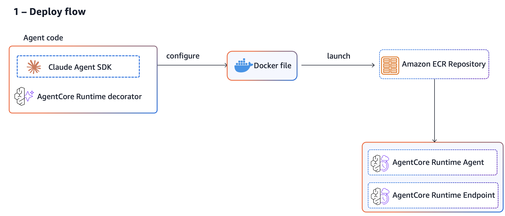
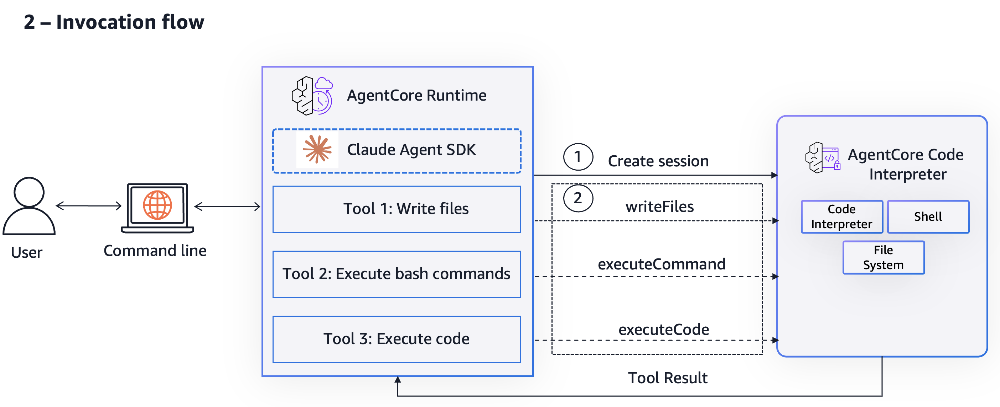

# Code execution in Code Interpreter using Claude Agent

## Attribution & License

This project is based on the [Claude Agent with Code Interpreter](https://github.com/awslabs/amazon-bedrock-agentcore-samples/tree/main/03-integrations/agentic-frameworks/claude-agent/claude-with-code-interpreter) sample from [AWS Labs](https://github.com/awslabs/amazon-bedrock-agentcore-samples).

Licensed under **Apache License 2.0**. See [LICENSE](LICENSE) for details.

See [CHANGELOG.md](CHANGELOG.md) for a detailed list of modifications from the original.

## Live Demo

Visit the project site: **[agentcore.damri.org](https://agentcore.damri.org/)**

---

This project demonstrates a [Claude agent](https://docs.claude.com/en/api/agent-sdk/overview) deployed on [AWS Bedrock AgentCore](https://docs.aws.amazon.com/bedrock-agentcore/latest/devguide/) that creates [Code Interpreter](https://docs.aws.amazon.com/bedrock-agentcore/latest/devguide/code-interpreter-tool.html) sessions to securely execute code.

We demonstrate this by building a Claude Agent that interprets user prompt, creates Code Interpreter session, invokes bash and code execution operations within the Code Interpreter environment, and returns a response.

## Extended Features

This fork extends the original AWS sample with:

### 1. Browser Automation
- Web scraping with CSS selectors
- Screenshot capture
- Form filling and search automation
- See [BROWSER_AUTOMATION_README.md](BROWSER_AUTOMATION_README.md) for full documentation

### 2. Claude Skills Integration
- Support for Claude Code Skills (PPTX creation, data analysis)
- Skills loaded from `.claude/skills/` directory
- Dynamic model selection (Bedrock or Anthropic API)

### 3. Robust Agentic Loop
- Enhanced error handling that prevents crashes on malformed JSON
- Session ID persistence across tool invocations
- Streaming responses with detailed logging

### 4. Utility Scripts
- `download_session_files.py` - Interactive file browser for Code Interpreter sessions
- Presentation creation examples




## Overview

The project includes:
- An agent that uses Claude to orchestrate code execution
- An MCP server that wraps the Code Interpreter tools
- A client to invoke the Code Interpreter APIs using boto3 SDK
- Docker containerization for AgentCore deployment

## Prerequisites

- Python 3.11+
- [uv](https://github.com/astral-sh/uv) - Fast Python package installer and resolver
- [Node.js 18+](https://nodejs.org/) and npm (required for Claude Code CLI)
- Docker (for containerization)
- AWS CLI configured (`aws configure`) with Bedrock AgentCore permissions
- Enable access to Claude models via Amazon Bedrock console

## Setup

### 1. Clone the repository
```bash
git clone https://github.com/talchaimdamri/agentcore-demo.git
cd agentcore-demo
```

### 2. Install uv (if not installed)
``` bash
# macOS/Linux
curl -LsSf https://astral.sh/uv/install.sh | sh

# Windows
powershell -c "irm https://astral.sh/uv/install.ps1 | iex"

# Or via pip
pip install uv
```

### 3. Setup virtual environment
```bash
# Create and activate a virtual environment. pyproject.toml is provided for you.
uv sync
source .venv/bin/activate  # On Windows: .venv\Scripts\activate
```

### 4. Install Playwright (for browser automation)
```bash
# Install Playwright browser
playwright install chromium
```

### 5. Deploy to AgentCore using AgentCore Starter Toolkit
```bash
# Configure agent for deployment
agentcore configure --entrypoint agent.py --name claude_ci_agent --disable-memory
```

During the configuration setup, choose 2 - Container deployment type

Select deployment type:
  1. Direct Code Deploy (recommended) - Python only, no Docker required
  2. Container - For custom runtimes or complex dependencies


# Launch agent
```
agentcore launch
```

**Note**: Record the agent arn that gets displayed once the agent launches successfully. You will need it for testing.

**Note**: The Claude Agent SDK requires either `ANTHROPIC_API_KEY` or AWS Bedrock access configured as environment variables. This example uses `CLAUDE_CODE_USE_BEDROCK=1` to enable Bedrock integration. You can set these environment variables in the Dockerfile or inline with the --env option. For more details on configuration options, see the [Claude Agent SDK documentation](https://docs.claude.com/en/api/agent-sdk/overview#core-concepts).

**Note**: The starter toolkit automatically creates a Dockerfile and deploys agents to AgentCore Runtime. Since this example requires the Claude Code CLI as a dependency, we override with our own Dockerfile that has the added npm installation.

### 6. Test your agent

Use toolkit command to test agent. 
```bash
agentcore invoke '{"prompt":"Create a sample data set of a retail store orders. Create a simple data analysis on a sample dataset. Save the files."}'
```

For the above prompt, the agent will 
- interpret the prompt
- write python code to create sample data set
- start a code interpreter session and execute the code
- write python code to perform data analysis
- use the code interpreter session to execute the code for data analysis
- use the code interpreter session to save the files 
- send summary back to the user


**OR** you can use the script provided in the test_scripts directory. It has a few sample prompts.
```bash
uv run test_scripts/invoke_agent.py
```

**Note**: Change the `agent_arn` variable to your deployed agent arn in invoke_agent.py before running the script.

#### Test Browser Automation
```bash
agentcore invoke '{"prompt":"Go to example.com and take a screenshot of the page"}'
```

## What It Does

You can use the agent to:
- Maintain an isolated Code Interpreter session
- Transfer files to the session
- Execute Python code within the session
- Execute bash commands

## Project Structure

```
.
├── code_int_mcp/                # Code Interpreter MCP server
│   ├── client.py                # Client to invoke Code Interpreter APIs
│   ├── models.py                # Pydantic data models
│   ├── server.py                # MCP server with tools
│   └── __init__.py
├── browser_mcp/                 # Browser Automation MCP server (NEW)
│   ├── server.py                # Browser tools: search, scrape, screenshot
│   └── __init__.py
├── .claude/skills/              # Claude Code Skills (NEW)
│   └── cc-conversation-analyzer/
├── test_scripts/
│   ├── invoke_agent.py          # Client to invoke deployed agent
│   ├── cleanup.py               # Cleanup script
│   └── ...                      # Additional test utilities
├── agent.py                     # Main agent implementation (enhanced)
├── browser_utils.py             # BrowserManager class (NEW)
├── download_session_files.py    # Interactive file downloader (NEW)
├── Dockerfile                   # Container image definition
├── pyproject.toml               # Python package configuration
├── BROWSER_AUTOMATION_README.md # Browser automation docs (NEW)
├── CHANGELOG.md                 # List of modifications (NEW)
├── LICENSE                      # Apache 2.0 license
└── README.md                    # This file
```

### Understanding the agent code
Claude Agent SDK supports two types of interactions - query() and ClaudeSDKClient. A quick comparison is provided [here](https://docs.claude.com/en/api/agent-sdk/python#quick-comparison). In this example, we specifically use the ClaudeSDKClient since it supports the use of custom tools.

The agent's system prompt in our example is extremely specific to use Code Interpreter tool for executing bash, file read/write operations and code. This is done to override the default behavior of Claude Agent that uses its own tools for these operations. The agent maintains the code interpreter session id during the complete agent session.

The Code Interprter tool operations (`code_int_mcp/server.py`) are created as custom tools for Claude Agent to use. [Custom tools](https://docs.claude.com/en/api/agent-sdk/custom-tools) allow for plugging in our own tools to Claude Agent through in process MCP server. The `code_int_mcp/client.py` is a simple class that the server uses to invoke Code Interpreter operations via boto3 SDK. The tools should have a [specific naming format](https://docs.claude.com/en/api/agent-sdk/custom-tools#tool-name-format) for Claude agent to be able to use them. 

Code Interpreter's session runs in a dedicated microVM with isolated CPU, memory and filesystem resources. It is ideal that a client re-uses the session for a user request. With that in mind, the agent takes in a payload of `prompt` and `code_int_session_id` and reuses that session. Ideally we would pass sesison ids in headers in real world applications. But to demonstrate the session functionality we pass it as part of payload. 

In order to demonstrate how the agent works, there is extensive logging within the code. Only use them while testing. 

Claude code by default has a model configured, but this can be changed via model property in ClaudeAgentOptions. More details [here](https://code.claude.com/docs/en/amazon-bedrock)

### Understanding the test script
`test_scripts\invoke_agent.py` uses boto3 sdk to invoke agent deployed on AgentCore Runtime agent. As the agent sends response, the script streams it to the terminal, this inclues actions, tools invoked and the final response. 

### Cleanup

#### 1. Destroy agent and all its associated resources
```bash
agentcore destroy
```

You'll see output similar to:

```bash
⚠️  About to destroy resources for agent 'code-interpreter-with-claude'

Current deployment:
  • Agent ARN: arn:aws:bedrock-agentcore:eu-central-1:XXXXXXXXXXXX:runtime/code-interpreter-with-claude-XXXXXXXXXX
  • Agent ID: code-interpreter-with-claude-XXXXXXXXXX
  • ECR Repository: XXXXXXXXXXXX.dkr.ecr.eu-central-1.amazonaws.com/bedrock-agentcore-claude_agent_simple
  • Execution Role: arn:aws:iam::XXXXXXXXXXXX:role/AmazonBedrockAgentCoreSDKRuntime-eu-central-1-XXXXXXXXXX

This will permanently delete AWS resources and cannot be undone!
Are you sure you want to destroy the agent 'code-interpreter-with-claude' and all its resources? [y/N]: 
```
Type y to confirm and permanently delete the agent and all its associated resources including the ECR repository and execution role.

#### 2. Terminate sessions
If you used `test_scripts\invoke_agent.py` to test your agent, once all the prompts are processed, the code interpreter session is terminated.

If you used `agentcore invoke` to test your agent, then terminate the session using the `test_scripts/cleanup.py` script. The `code-int-session-id` is returned as part of the response and printed on the terminal when the test script is executed. This is just for testing, in real production deployment, session id logging should be disabled. 

```bash
uv run test_scripts/cleanup.py --code_int_session_id="<code-int-session-id>"
```

If ever agent gets stuck and doesnt respond,  you can stop the runtime session using
```bash
uv run test_scripts/cleanup.py --runtime_session_id="<runtime_session_id>"
```
